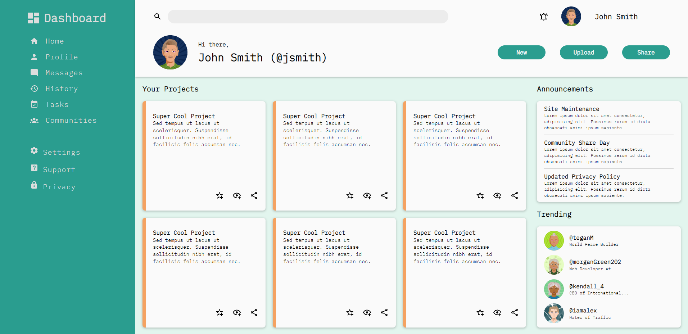

# Admin Dashboard

**Link to project:** https://johnsebastian3.github.io/admin-dashboard/

## How It's Made:

**Tech used:** HTML, CSS

This dashboard is build almost entirely with CSS Grid. It was a project to really solidify Grid. 

## Optimizations

Optimization planned is to add responsiveness and refactor code for greater performance/accessability.

## Lessons Learned:

I learned alot about CSS Grid. More specifically, I learned how to really effectively make grid templates using auto-fill and min-max.

